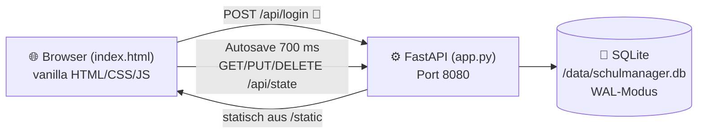

<div align="center">

[](https://www.buymeacoffee.com/highfish)


# 📚 trt.Schulmanager

### Das Lehrer-Cockpit für den Schulalltag — Klassenbuch · Schüler · Noten · Planung 🏫

[](https://github.com/jbkunama1/trt.Schulmanager)
[](https://github.com/jbkunama1/trt.Schulmanager)
[](https://github.com/jbkunama1/trt.Schulmanager)
[](https://github.com/jbkunama1/trt.Schulmanager)
[](https://github.com/jbkunama1/trt.Schulmanager/pkgs/container/trt.schulmanager)
[](#-themes)
[](./LICENSE)

[🌐 Live-Demo](https://jbkunama1.github.io/trt.Schulmanager/) · [🚀 Deployment](#-deployment) · [📦 Portainer-Deploy](#-portainer-deploy-aus-github-empfohlen) · [🧩 Module](#-module) · [🎨 Themes](#-themes)

</div>

---

## 🌈 Was ist trt.Schulmanager?

`trt.Schulmanager` ist die **Fusion aus drei bewährten Lehrer-Apps** — entwickelt für den echten Unterrichtsalltag an der Realschule (Sport, Technik, WBS, Informatik, Medienbildung). Eine einzige Web-App für **Planung, Dokumentation, Schülerverwaltung und Noten** — mobilfreundlich, selbst gehostet, datenschutzfreundlich.

| 🔀 Vorgänger-Projekt | 🎁 Eingebrachte Module |
|---|---|
| [`trt.Klassenbuch`](https://github.com/jbkunama1/trt.Klassenbuch) | 📖 Wochen-Klassenbuch (KW-Navigation, Fach/LK/Thema/Hausaufgabe/Bemerkung), 🗓️ Wochenreflexionen, 📋 Klassenlisten, 🧭 Stoffverteilung, 📚 UVP/Beobachtung/Reflexion |
| [`trt.Schuelermanager`](https://github.com/jbkunama1/trt.Schuelermanager) | 👥 Schülerprofile mit 📷 Foto, 🏷️ Besonderheiten, ⭐ Sozialpunkten, 📊 Statistik-Dashboard |
| `Notenwerk` (Nachbau der „Notenrechner"-App) | 🧮 Notenschlüssel (IHK, KMK 15–0, linear), 🔑 Schlüssel-Generator (16 Stufen, Sockel), 📝 Notenmatrix mit Gewichtung & Overrides, 🎓 automatische Zeugnisnote, 📈 Durchschnittsrechner |

**✅ Verbessert gegenüber den Originalen:** echte SQLite-Persistenz (statt Nur-im-Speicher), serverseitiges Login mit ENV-Passwort (statt hardcoded im JavaScript), korrekte ISO-8601-Kalenderwochen, Autosave mit Multi-Device-Sync, 🎨 **11 Themes** im Admin-Bereich.

---

## 🧩 Module

| Modul | Funktionen |
|---|---|
| 📊 **Dashboard** | Klassen, Schüler, Wocheneinträge, erfasste Noten, aktive Einheiten, Ø Sozialpunkte, Dokumente — alles auf einen Blick |
| 📖 **Klassenbuch** | ISO-KW-Navigation ⬅️➡️, Mo–Fr × konfigurierbare Stundenzahl, Stunden-Editor (Fach, LK, Thema, HA, Bemerkung), Wochenreflexion, 🖨️ Wochen-Druck |
| 👥 **Klassen** | Klassen & Fächer, Schülerprofile (Foto wird automatisch verkleinert, Besonderheiten, Sozialpunkte), 🖨️ Klassenlisten-Druck |
| 📝 **Noten** | Klausuren / Teilnoten / mündliche Noten, Notenmatrix mit Live-Note, manuelle Overrides, gewichtete Zeugnisnote, Notenverteilung, 🖨️ Zeugnis-Druck/PDF, 📤 CSV-Export |
| 🧮 **Rechner** | Schnellrechner mit allen Schlüsseln + Sockel + 3 Rundungsmodi, 🔑 Schlüssel-Generator (16 Notenstufen), ⚖️ Durchschnittsrechner |
| 🗂️ **Planung** | Stoffverteilung (Geplant / In Bearbeitung / Abgeschlossen), UVP-, Beobachtungs- und Reflexions-Dokumente |
| 🎛️ **Admin** | Theme-Galerie (11 Themes, serverweit für alle Geräte), Stunden-pro-Tag, Sicherheitshinweise |
| 💾 **Backup** | JSON-Export/Import, Server-Löschung, Sync-Statusanzeige |

---

## 🏗️ Architektur



- **🗂️ Projektstruktur:**

```text
trt.Schulmanager/
├── index.html                     # 🌐 Komplette App (alle 8 Module, 11 Themes)
├── backend/
│   ├── app.py                     # ⚙️ FastAPI: Login, State-API, SQLite
│   └── requirements.txt           # 🐍 fastapi, uvicorn
├── Dockerfile                     # 🐳 python:3.12-slim + Healthcheck
├── docker-compose.yml             # 🚀 GHCR-Image, Port 8086, Volume, APP_PASSWORD
├── .github/workflows/
│   ├── build-and-push.yml         # 🐳 Build & Push nach GHCR + Trivy-Scan
│   └── deploy-pages.yml           # 📄 GitHub-Pages-Deployment (Live-Demo)
├── docs/
│   └── banner.svg                 # 🎨 README-Banner
├── LICENSE                        # 📄 MIT
└── README.md
```

- **⚙️ CI/CD (GitHub Actions):**
  - **`build-and-push.yml`** — baut bei jedem Push auf `main` (und bei `v*`-Tags) das Docker-Image und pusht es nach **GHCR**: `ghcr.io/jbkunama1/trt.schulmanager` mit den Tags `latest`, `main`, `vX.Y.Z` und Commit-SHA. Danach läuft automatisch ein **Trivy-Security-Scan**.
  - **`deploy-pages.yml`** — deployt die statische Live-Demo auf GitHub Pages.

- **🔌 API:**

| Methode | Pfad | Funktion |
|---|---|---|
| `POST` | `/api/login` | 🔐 Passwort-Login → Bearer-Token |
| `GET` | `/api/state` | 📥 Gesamten State laden |
| `PUT` | `/api/state` | 💾 State speichern (Autosave) |
| `DELETE` | `/api/state` | 🗑️ Alles löschen |
| `GET` | `/api/health` | 🩺 Healthcheck (inkl. DB-Check) |

---

## 🎨 Themes

11 Themes — im **Admin-Bereich** einstellbar (gilt serverweit für alle Geräte) oder per Dropdown im Header:

| Theme | Stil | Emoji |
|---|---|---|
| **Standard** | Modern & hell (Blau) | ⚪ |
| **Midnight** | Modern & dunkel (Slate) | 🌑 |
| **70s** | Orange, Braun & Creme | 🧡 |
| **80s Synthwave** | Neon-Pink auf Violett, Button-Glow | 💜 |
| **Matrix** | Neongrün auf Schwarz, Monospace | 🟩 |
| **Retro CRT** | Bernstein-Terminal, eckige Ecken | 🟧 |
| **Sport** | Frisches Grün, dynamisch | ⚽ |
| **Buch** | Papier, Lederbraun, Serifen | 📖 |
| **Schule** | Kreidetafel & Kreidegelb | 🖍️ |
| **Ocean** | Ruhiges Petrol-Blau | 🌊 |
| **Pastell** | Weiches Violett | 🦄 |

> 💡 Ideen für weitere Themes (z. B. KSC Blau-Weiß 🇩🇪⚽) willkommen!

---

## 🚀 Deployment

### 📦 Portainer-Deploy aus GitHub (empfohlen)

Der Stack nutzt das **fertige GHCR-Image** — auf dem Server wird nichts gebaut, nur gezogen:

1. **GHCR-Package einmalig öffentlich stellen** (sonst kann Portainer ohne Login nicht ziehen):
   Profil → **Packages** → `trt.schulmanager` → *Package settings* → *Change visibility* → **Public**
2. **Portainer** → *Stacks* → **+ Add stack**
   - **Name:** `trt-schulmanager`
   - **Build method:** 🗂️ *Repository*
   - **Repository URL:** `https://github.com/jbkunama1/trt.Schulmanager.git`
   - **Compose path:** `docker-compose.yml`
   - *(Optional unter Advanced → Environment variables: `APP_PASSWORD=dein-geheimes-passwort`)*
3. **Deploy the stack** 🚀

> 🔄 Jeder Push auf `main` baut automatisch ein neues `latest`-Image via GitHub Actions — in Portainer dann einfach *Stacks → trt-schulmanager → Pull and redeploy*.

**Der Inhalt der `docker-compose.yml` im Überblick:**

```yaml
services:
  schulmanager:
    image: ghcr.io/jbkunama1/trt.schulmanager:latest
    container_name: trt-schulmanager
    ports:
      - "8086:8080"
    volumes:
      - schulmanager-data:/data
    environment:
      - APP_PASSWORD=lehrer2026   # ⚠️ anpassen!
    restart: unless-stopped
```

Danach erreichbar unter `http://<server-ip>:8086`. Die SQLite-Datenbank liegt im Volume `schulmanager-data` und überlebt Updates & Neustarts.

### 🐳 Docker ohne Portainer

```bash
# Variante A: GHCR-Image ziehen (kein Build nötig)
docker run -d --name trt-schulmanager \
  -p 8086:8080 \
  -v trt-schulmanager-data:/data \
  -e APP_PASSWORD="dein-passwort" \
  --restart unless-stopped \
  ghcr.io/jbkunama1/trt.schulmanager:latest

# Variante B: selbst bauen
 git clone https://github.com/jbkunama1/trt.Schulmanager.git
 cd trt.Schulmanager
 docker build -t trt-schulmanager .
 docker run -d --name trt-schulmanager -p 8086:8080 -v trt-schulmanager-data:/data -e APP_PASSWORD="dein-passwort" --restart unless-stopped trt-schulmanager
```

**💾 Datenbank sichern:**

```bash
docker exec trt-schulmanager sqlite3 /data/schulmanager.db "SELECT updated_at, length(json) FROM state;"
docker cp trt-schulmanager:/data/schulmanager.db ./backup-$(date +%F).db
```

### 📄 GitHub Pages (Live-Demo)

Die [Live-Demo](https://jbkunama1.github.io/trt.Schulmanager/) läuft **ohne Backend** im Offline-Modus: alle Daten bleiben im Browser (localStorage), Login wird übersprungen. Perfekt zum Ausprobieren der Themes und Module — für echte, dauerhafte Daten den Docker-Container nutzen.

> ⚙️ Einmalig aktivieren: **Repo → Settings → Pages → Source: „GitHub Actions“** — danach deployt jeder Push auf `main` automatisch.

### 🏠 Heimnetz-Einbindung

Hinter bestehendem nginx/Cloudflare-Reverse-Proxy als zusätzlicher Upstream einbinden (z. B. `schulmanager.lan`).

---

## 🔐 Sicherheit & Datenschutz

- 🔑 Login serverseitig geprüft, Passwort über Umgebungsvariable `APP_PASSWORD` (nie im Frontend-Code)
- 🎫 Session-Token nur im RAM des Containers — Container-Restart meldet alle Sitzungen ab
- 🚫 Kein Account-System, kein Tracking, keine Cloud — Daten bleiben auf deinem Server
- 👤 Schülerdaten (Name, Foto, Besonderheiten!): **Pseudonymisierung** (Initialen, Listenplätze) empfohlen — die Lehrkraft bleibt datenschutzrechtlich verantwortlich
- 🛡️ Für Zugriff aus dem Internet: Reverse-Proxy mit Auth (z. B. Cloudflare Access, nginx Basic Auth) davor schalten

---

## 🖨️ Exporte

| Export | Format | Weg |
|---|---|---|
| Klassenbuch-Woche | 🖨️ Druck/PDF | Tab „Klassenbuch“ → Woche drucken |
| Klassenliste | 🖨️ Druck/PDF | Tab „Klassen“ → Klassenliste |
| Zeugnisübersicht | 🖨️ Druck/PDF | Tab „Noten“ → Drucken/PDF |
| Notenmatrix | 📊 CSV (Excel-kompatibel, UTF-8) | Tab „Noten“ → CSV-Export |
| Alles | 💾 JSON | Tab „Backup“ → Backup erstellen |

---

## 🗺️ Roadmap

- [ ] 📝 Bewertungsbogen-Modul (Hospitationsbögen aus `trt.Klassenbuch/bewertungsbogen`)
- [ ] ✅ Anwesenheitserfassung direkt im Klassenbuch
- [ ] 📱 PWA (Service Worker) für echte Offline-Nutzung
- [ ] 🇩🇪 Bundesland-Notenschlüssel (BW, Bayern, NRW) als Vorlagen
- [ ] 👤 Schüler-Notenansicht (schriftlich/mündlich-Listen aus trt.Schuelermanager)
- [ ] 🎨 Custom-Theme-Editor (eigene Farben im Admin-Bereich)

---

## 🧪 Tech Stack

- 🧱 **Frontend:** HTML5, CSS3 (Custom Properties für 11 Themes), Vanilla JavaScript (ES6) — keine Build-Pipeline, keine externen Abhängigkeiten
- ⚙️ **Backend:** Python 3.12, FastAPI, uvicorn
- 💾 **Datenbank:** SQLite (Standardbibliothek, WAL-Modus)
- 🐳 **Deployment:** GHCR-Image via GitHub Actions (Buildx + metadata-action + Trivy-Scan), Portainer-Stack oder docker run, Healthcheck
- 📄 **Demo:** GitHub Pages via GitHub Actions

---

## 📄 Lizenz

Dieses Projekt steht unter der **MIT License** — siehe [`LICENSE`](./LICENSE).

Fusion der eigenen Projekte `trt.Klassenbuch`, `trt.Schuelermanager` und `Notenwerk`. 🚀

<div align="center">

**⭐ Gefällt dir trt.Schulmanager? Lass ein Sternchen da! ⭐**

Made with ❤️ for teachers · [🍀 Buy me a coffee](https://www.buymeacoffee.com/highfish)

</div>
