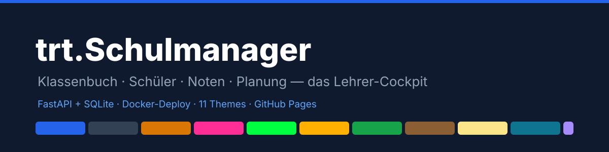
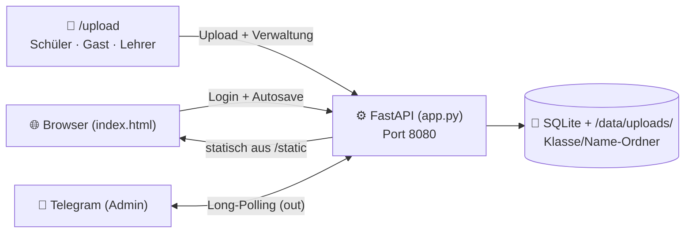

<div align="center">

[](https://www.buymeacoffee.com/highfish)



# 📚 trt.Schulmanager

### Das Lehrer-Cockpit für den Schulalltag — Klassenbuch · Schüler · Noten · Planung · Ablage 🏫

[](https://github.com/jbkunama1/trt.Schulmanager)
[](https://github.com/jbkunama1/trt.Schulmanager)
[](https://github.com/jbkunama1/trt.Schulmanager)
[](https://github.com/jbkunama1/trt.Schulmanager)
[](https://github.com/jbkunama1/trt.Schulmanager/pkgs/container/trt.schulmanager)
[](#-themes)
[](#-telegram-integration)
[](./LICENSE)

[🌐 Live-Demo](https://jbkunama1.github.io/trt.Schulmanager/) · [🚀 Deployment](#-deployment) · [📦 Portainer](#-portainer-deploy-aus-github-empfohlen) · [🤖 Telegram](#-telegram-integration) · [📎 Ablage](#-abage--upload--schler-zuge) · [🎨 Themes](#-themes)

</div>

---

## 🌈 Was ist trt.Schulmanager?

`trt.Schulmanager` ist die **Fusion aus drei bewährten Lehrer-Apps** — entwickelt für den echten Unterrichtsalltag an der Realschule (Sport, Technik, WBS, Informatik, Medienbildung). Eine einzige Web-App für **Planung, Dokumentation, Schülerverwaltung, Noten und Abgaben** — mobilfreundlich (Mobile-First!), selbst gehostet, datenschutzfreundlich.

| 🔀 Vorgänger-Projekt | 🎁 Eingebrachte Module |
|---|---|
| [`trt.Klassenbuch`](https://github.com/jbkunama1/trt.Klassenbuch) | 📖 Wochen-Klassenbuch (KW-Navigation, Fach/LK/Thema/Hausaufgabe/Bemerkung), 🗓️ Wochenreflexionen, 📋 Klassenlisten, 🧭 Stoffverteilung, 📚 UVP/Beobachtung/Reflexion |
| [`trt.Schuelermanager`](https://github.com/jbkunama1/trt.Schuelermanager) | 👥 Schülerprofile mit 📷 Foto, 🏷️ Besonderheiten, ⭐ Sozialpunkten, 📊 Statistik-Dashboard |
| `Notenwerk` (Nachbau der „Notenrechner"-App) | 🧮 Notenschlüssel (IHK, KMK 15–0, linear), 🔑 Schlüssel-Generator (16 Stufen, Sockel), 📝 Notenmatrix mit Gewichtung & Overrides, 🎓 automatische Zeugnisnote, 📈 Durchschnittsrechner |

**✅ Verbessert gegenüber den Originalen:** echte SQLite-Persistenz, serverseitiges Login mit ENV-Passwort, korrekte ISO-8601-Kalenderwochen, Autosave mit Multi-Device-Sync, 🎨 11 Themes im Admin-Bereich, 📱 Mobile-First-Ansicht, 🤖 Telegram-Admin-Bot, 📎 Ablage mit individuellen Schüler-Zugängen (6-stelliger Code → eigenes Verzeichnis).

---

## 🧩 Module

| Modul | Funktionen |
|---|---|
| 📊 **Dashboard** | Klassen, Schüler, Wocheneinträge, erfasste Noten, aktive Einheiten, Ø Sozialpunkte, Dokumente |
| 📖 **Klassenbuch** | ISO-KW-Navigation, Mo–Fr × konfigurierbare Stundenzahl, Stunden-Editor, Wochenreflexion, 🖨️ Wochen-Druck |
| 👥 **Klassen** | Klassen & Fächer, Schülerprofile (Foto, Besonderheiten, Sozialpunkte), 🖨️ Klassenlisten-Druck |
| 📝 **Noten** | Notenmatrix mit Live-Note, Overrides, gewichtete Zeugnisnote, Verteilung, 🖨️ Druck/PDF, 📤 CSV |
| 🧮 **Rechner** | Schnellrechner (IHK/KMK/linear/Sockel, 3 Rundungsmodi), 🔑 Schlüssel-Generator, ⚖️ Durchschnittsrechner |
| 🗂️ **Planung** | Stoffverteilung mit Status, UVP-/Beobachtungs-/Reflexions-Dokumente |
| 🎛️ **Admin** | Theme-Galerie (11 Themes, serverweit), Stunden-pro-Tag, Sicherheitshinweise |
| 💾 **Backup** | JSON-Export/Import, Server-Löschung, Sync-Status |
| 📎 **Ablage** | `/upload`: Schüler-Zugänge (Code → eigenes Verzeichnis), Gast-Uploads, Lehrer-Verwaltung (rekursiv), Telegram-Datei-Empfang |

📱 **Mobile-First:** Klassenbuchzeilen als antippbare Karten, sticky Namensspalte in der Notenmatrix, Bottom-Sheet-Modals (iOS-Safe-Area), 16px-Inputs gegen iOS-Zoom, 44px-Touch-Targets, Statusleiste pro Theme gefärbt.

---

## 📎 Ablage, Upload & Schüler-Zugänge

Unter **`http://<server-ip>:8086/upload`** — drei Bereiche auf einer Seite:

### 🎓 Schüler-Zugänge (das Herzstück)

**Als Lehrer** (im Lehrer-Bereich der `/upload`-Seite):

1. **Name + Klasse** eingeben → „Zugang erstellen“
2. Das System generiert einen **6-stelligen Code** (z. B. `483920`) und legt automatisch das passende Verzeichnis an: `uploads/<Klasse>/<Name>/`
3. Du siehst eine **Verwaltungstabelle**: Name, Klasse, Code, Datei-Zähler — Zugang jederzeit löschbar

**Als Schüler:**

1. Auf `/upload` den **6-stelligen Code** eingeben → angemeldet
2. Sieht **ausschließlich sein eigenes Verzeichnis** — Dateien hochladen, herunterladen, eigene löschen
3. Kein Passwort, kein Konto, keine Einsicht in fremde Dateien

### Berechtigungs-Matrix

| | Hochladen | Eigene Dateien sehen | Fremde Dateien sehen | Alles löschen |
|---|---|---|---|---|
| **Schüler (Code)** | ✅ nur eigener Ordner | ✅ | ❌ | nur eigene |
| **Gast (`UPLOAD_CODE`)** | ✅ allgemeine Ablage | ❌ | ❌ | ❌ |
| **Lehrer (Passwort)** | ✅ überall | ✅ | ✅ (rekursiv) | ✅ |
| **Telegram** | ✅ (nur Admin) | via `/files` | via `/files` | ❌ |

> 🤖 **Telegram ist reine Admin-Sache:** Der Bot antwortet ausschließlich der `TELEGRAM_CHAT_ID` — Schüler-Codes funktionieren dort bewusst **nicht**. Schüler benutzen die Web-Seite.

**Technik & Limits:** Speicherort `/data/uploads/` (Docker-Volume) · max. 25 MB pro Datei (Telegram: 20 MB) · sanitizierte Dateinamen (kein Path-Traversal; Pfade werden zusätzlich serverseitig validiert) · Namens-Kollisionen → `_1`-Suffix · Schüler-Codes + Verzeichnisse in SQLite (`student_access`-Tabelle) · Download/Löschen fremder Dateien nur mit Lehrer-Token.

**ENV:** `UPLOAD_CODE` (leer = Gast-Upload ohne Code möglich).

---

## 🤖 Telegram-Integration (nur Admin)

Der eingebaute Bot (reine Python-Standardbibliothek) holt sich die Daten direkt aus der SQLite-Datenbank und antwortet **ausschließlich deiner Chat-ID** (`TELEGRAM_CHAT_ID`). Ohne gesetzte Chat-ID verrät `/start` dem ersten Chat nur dessen ID — nichts weiter.

### Setup (5 Minuten)

1. **Bot erstellen:** [@BotFather](https://t.me/BotFather) → `/newbot` → Token kopieren
2. **ENV setzen:** `TELEGRAM_BOT_TOKEN` eintragen, `TELEGRAM_CHAT_ID` erstmal leer, `REMINDER_TIME` z. B. `17:30`
3. **Container neu starten** → Bot `/start` schicken → er antwortet mit deiner **Chat-ID**
4. Chat-ID als `TELEGRAM_CHAT_ID` eintragen → neu starten → fertig ✅

> Ohne `TELEGRAM_BOT_TOKEN` ist die Integration komplett deaktiviert — null Overhead.

### Commands (Admin)

| Befehl | Antwort |
|---|---|
| `/status` | 📊 Klassen, Schüler, Wocheneinträge, erfasste Noten, aktive Einheiten |
| `/heute` | 📖 Heutige Klassenbuchstunden (Fach, Thema, Hausaufgabe) |
| `/noten 9b` | 🎓 Zeugnisnoten je Schüler (Notenschlüssel-Logik 1:1 portiert) |
| `/files` | 📎 Neueste 10 Dateien der Ablage (rekursiv, inkl. Schülerordner) |
| `/help` | Befehlsübersicht |

**📎 Dateien ablegen:** Dokumente/Fotos in den Chat schicken → Bot lädt sie herunter → landen in der allgemeinen Ablage (mit Bestätigung).

### ⏰ Tägliche Erinnerung

Mo–Fr zur `REMINDER_TIME`: Klassenbuch heute leer → Nachricht. Eingetragen → Stille.

> 🛡️ Nur ausgehende Verbindungen (Long-Polling) — keine eingehenden Ports, kein Webhook nötig.

---

## 🏗️ Architektur



- **🗂️ Projektstruktur:**

```text
trt.Schulmanager/
├── index.html                     # 🌐 Komplette App (8 Module, 11 Themes, Mobile-First)
├── backend/
│   ├── app.py                     # ⚙️ FastAPI: State-API, Telegram, Ablage, Schüler-Zugänge
│   └── requirements.txt           # 🐍 fastapi, uvicorn (alles andere = stdlib!)
├── Dockerfile                     # 🐳 python:3.12-slim + Healthcheck
├── docker-compose.yml             # 🚀 GHCR-Image, Port 8086, Volume, ENVs
├── .github/workflows/
│   ├── build-and-push.yml         # 🐳 GHCR-Build + Trivy-Scan
│   └── deploy-pages.yml           # 📄 Pages-Demo
├── docs/banner.svg                # 🎨 README-Banner
├── LICENSE                        # 📄 MIT
└── README.md
```

- **🔌 API:**

| Methode | Pfad | Funktion |
|---|---|---|
| `POST` | `/api/login` | 🔐 Lehrer-Login → Bearer-Token |
| `GET`/`PUT`/`DELETE` | `/api/state` | 📥💾🗑️ App-State (auth) |
| `POST` | `/api/upload` | 📎 Gast-Upload (optional `UPLOAD_CODE`) |
| `GET`/`DELETE` | `/api/files/{pfad}` | ⬇️🗑️ Lehrer: alle Dateien rekursiv (auth) |
| `POST`/`GET`/`DELETE` | `/api/students` | 👥 Lehrer: Schüler-Zugänge anlegen/auflisten/löschen (auth) |
| `POST` | `/api/slogin` | 🎓 Schüler-Login mit 6-stelligem Code → Token |
| `POST` | `/api/supload` | 📤 Schüler-Upload in eigenes Verzeichnis |
| `GET`/`DELETE` | `/api/sfiles/{name}` | 📄 Schüler: eigene Dateien sehen/laden/löschen |
| `GET` | `/upload` | 🌐 Ablage-Seite (Schüler · Gast · Lehrer) |
| `GET` | `/api/health` | 🩺 Healthcheck (inkl. DB-Check) |

---

## 🎨 Themes

11 Themes — im **Admin-Bereich** einstellbar (gilt serverweit für alle Geräte) oder per Dropdown im Header:

| Theme | Stil | Emoji |
|---|---|---|
| **Standard** | Modern & hell (Blau) | ⚪ |
| **Midnight** | Modern & dunkel (Slate) | 🌑 |
| **70s** | Orange, Braun & Creme | 🧡 |
| **80s Synthwave** | Neon-Pink auf Violett | 💜 |
| **Matrix** | Neongrün auf Schwarz | 🟩 |
| **Retro CRT** | Bernstein-Terminal | 🟧 |
| **Sport** | Frisches Grün | ⚽ |
| **Buch** | Papier, Serifen | 📖 |
| **Schule** | Kreidetafel & Kreide | 🖍️ |
| **Ocean** | Petrol-Blau | 🌊 |
| **Pastell** | Weiches Violett | 🦄 |

---

## 🚀 Deployment

### 📦 Portainer-Deploy aus GitHub (empfohlen)

1. **GHCR-Package einmalig öffentlich stellen:** Profil → Packages → `trt.schulmanager` → *Change visibility* → **Public**
2. **Portainer** → Stacks → + Add stack → *Repository*: `https://github.com/jbkunama1/trt.Schulmanager.git`, Compose path `docker-compose.yml`
3. **Umgebungsvariablen** (Advanced → Environment variables):

| ENV | Pflicht | Bedeutung |
|---|---|---|
| `APP_PASSWORD` | ✅ | Login-Passwort der Web-App (**ändern!** Standard: `lehrer2026`) |
| `TELEGRAM_BOT_TOKEN` | optional | Token von @BotFather — leer = Telegram aus |
| `TELEGRAM_CHAT_ID` | optional | Deine Chat-ID — schränkt den Bot auf dich (Admin) ein |
| `REMINDER_TIME` | optional | Klassenbuch-Erinnerung Mo–Fr, z. B. `17:30` — leer = aus |
| `UPLOAD_CODE` | optional | Gast-Upload-Code unter `/upload` — leer = offen |

4. **Deploy** 🚀 — Updates künftig per *Pull and redeploy*

**Compose im Überblick:**

```yaml
services:
  schulmanager:
    image: ghcr.io/jbkunama1/trt.schulmanager:latest
    container_name: trt-schulmanager
    ports:
      - "8086:8080"
    volumes:
      - schulmanager-data:/data
    environment:
      - APP_PASSWORD=lehrer2026        # ⚠️ anpassen!
      - TELEGRAM_BOT_TOKEN=            # 🤖 leer = aus
      - TELEGRAM_CHAT_ID=
      - REMINDER_TIME=17:30
      - UPLOAD_CODE=                   # 📎 Gast-Upload
    restart: unless-stopped
```

Erreichbar unter `http://<server-ip>:8086` (App) bzw. `/upload` (Ablage). SQLite-DB, Schüler-Zugänge und alle Dateien liegen im Volume `schulmanager-data`.

### 🐳 Docker ohne Portainer

```bash
docker run -d --name trt-schulmanager \
  -p 8086:8080 \
  -v trt-schulmanager-data:/data \
  -e APP_PASSWORD="dein-passwort" \
  -e TELEGRAM_BOT_TOKEN="123:ABC" \
  -e TELEGRAM_CHAT_ID="123456" \
  --restart unless-stopped \
  ghcr.io/jbkunama1/trt.schulmanager:latest
```

**💾 Backup (DB + Ablage):**

```bash
docker cp trt-schulmanager:/data/schulmanager.db ./backup-$(date +%F).db
docker cp trt-schulmanager:/data/uploads ./backup-uploads-$(date +%F)
```

### 📄 GitHub Pages (Live-Demo)

Die [Live-Demo](https://jbkunama1.github.io/trt.Schulmanager/) läuft ohne Backend im Offline-Modus (localStorage, Login übersprungen). Für echte Daten den Docker-Container nutzen. Einmalig aktivieren: Repo → Settings → Pages → Source: „GitHub Actions“.

---

## 🔐 Sicherheit & Datenschutz

- 🔑 Lehrer-Login serverseitig, `APP_PASSWORD` als ENV — nie im Frontend-Code
- 🎓 Schüler-Codes: 6-stellig, kryptografisch zufällig (`secrets`), pro Schüler eigenes Verzeichnis — serverseitige Pfad-Validierung verhindert jeden Zugriff außerhalb des eigenen Ordners
- 📎 Gast-Uploads optional mit `UPLOAD_CODE`; Download/Löschen nur mit Lehrer-Token
- 🤖 Telegram: nur Admin (`TELEGRAM_CHAT_ID`), nur ausgehende Verbindungen
- 🚫 Kein Account-System, kein Tracking — Daten bleiben auf deinem Server
- 👤 Trotzdem gilt: Schülerdaten mit Bedacht (Pseudonymisierung), die Lehrkraft bleibt datenschutzrechtlich verantwortlich
- 🛡️ Internet-Zugriff nur hinter Reverse-Proxy mit Auth (Cloudflare Access, nginx Basic Auth)

---

## 🗺️ Roadmap

- [ ] 📝 Bewertungsbogen-Modul (Hospitationsbögen aus `trt.Klassenbuch/bewertungsbogen`)
- [ ] ✅ Anwesenheitserfassung direkt im Klassenbuch
- [ ] 📎 Ablage: Upload-Benachrichtigung an Lehrer via Telegram, Ordner-Download als ZIP
- [ ] 🎓 Schüler-Zugänge: Massen-Anlage (Klassenliste einlesen), Code-Export als CSV
- [ ] 📱 PWA (Service Worker) für echte Offline-Nutzung
- [ ] 🇩🇪 Bundesland-Notenschlüssel (BW, Bayern, NRW) als Vorlagen
- [ ] 🎨 Custom-Theme-Editor

---

## 🧪 Tech Stack

- 🧱 **Frontend:** HTML5, CSS3 (Custom Properties, Mobile-First), Vanilla JS (ES6) — keine externen Abhängigkeiten
- ⚙️ **Backend:** Python 3.12, FastAPI, uvicorn; Telegram-Bot, Uploads & Schüler-Zugänge in reiner Standardbibliothek
- 💾 **Daten:** SQLite (WAL) + Datei-Ablage mit `Klasse/Name`-Ordnerstruktur auf Docker-Volume
- 🐳 **Deployment:** GHCR via GitHub Actions (Buildx, metadata, Trivy), Portainer-Stack, Healthcheck
- 📄 **Demo:** GitHub Pages via GitHub Actions

---

## 📄 Lizenz

**MIT License** — siehe [`LICENSE`](./LICENSE).

Fusion der eigenen Projekte `trt.Klassenbuch`, `trt.Schuelermanager` und `Notenwerk`. 🚀

<div align="center">

**⭐ Gefällt dir trt.Schulmanager? Lass ein Sternchen da! ⭐**

Made with ❤️ for teachers · [🍀 Buy me a coffee](https://www.buymeacoffee.com/highfish)

</div>
